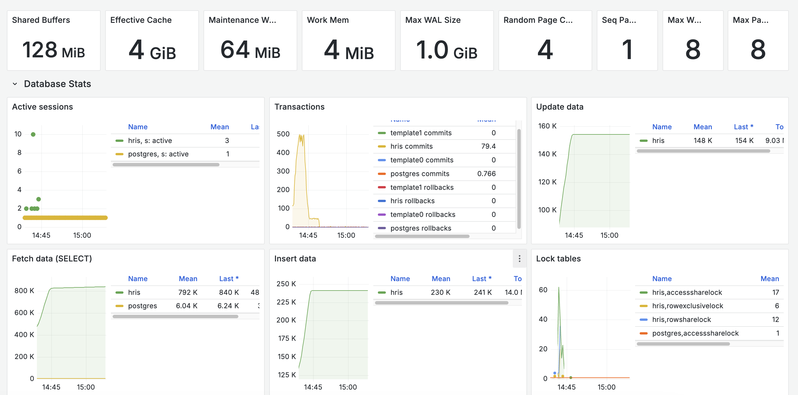

# **HRIS Backend System**

# **Описание проекта**

Для демонстрационных целей выбран мультимодульный монолит. При этом каждый модуль является автономным, собирается и деплоится отдельно, что позволяет при необходимости вынести их в отдельные репозитории. С точки зрения деплоя через Docker Compose система организована как набор микросервисов.

## **Transactional Outbox и уведомления**

Для обеспечения надежности доставки уведомлений используется паттерн **Transactional Outbox**. При изменении данных в основных таблицах (например, при создании или обновлении сотрудника, создании ревью) в рамках одной транзакции добавляется запись в таблицу **outbox**.

Сервис **notifications** реализует механизм Message Relay, который периодически считывает события из таблицы **outbox** и отправляет уведомления в RabbitMQ, используя соответствующие очереди и routing keys. Затем сообщения обрабатываются сервисом rabbit-consumer и выводятся в лог.

Такой подход обеспечивает:
- Гарантию, что уведомление не будет потеряно или продублировано.
- Возможность аудита событий, так как таблица **outbox** сохраняет информацию о всех изменениях.
- Изоляцию логики обработки данных (например, ревью и учета сотрудников) от логики отправки уведомлений пользователям.

---

### **Сервисы**

Приложение развёрнуто с использованием **Docker Compose**, который помимо основных сервисов содержит вспомогательные компоненты системы:

#### **Employees Service**
Отвечает за управление данными сотрудников и команд. Реализованы CRUD-операции, а также получение иерархии сотрудника (начальник, подчинённые, коллеги) и пагинация/сортировка списка сотрудников.

#### **Reviews Service**
CRUD-операции с перформанс-ревью и их и пагинация/сортировка. При создании ревью формируется событие в таблице **outbox**, которое затем используется для отправки персональных уведомлений сотруднику.

#### **Notifications Service**
Реализует паттерн **Transactional Outbox**: изменения в основных таблицах (**employees, reviews**) сопровождаются созданием записи в таблице **outbox**. Фоновый процесс (**Outbox Relay**) периодически считывает эти события и отправляет соответствующие уведомления через RabbitMQ с нужными **routing key**. Это гарантирует надёжную доставку уведомлений и повышает масштабируемость системы.

#### **Rabbit-consumer Service**
Клиент для RabbitMQ, который вычитывает сообщения из queue и выводит их в лог для демонстрации их получения.

#### **RabbitMQ**
Брокер сообщений для уведомлений.

#### **Prometheus & Grafana**
Система мониторинга и визуализации метрик. Поставляются отдельными контейнерами.

#### **Flyway**
Для версионирования и миграции базы данных.

#### **PostgreSQL**
База данных.

#### **Postgres-exporter**
Для отправки метрик базы данных в Prometheus

---

## **Схема базы данных**

### **См. скрипт миграции (db/migration/V1__init.sql)**

Для дальнейшей миграции и версионирования базы данных используется Flyway. Схема базы данных составлена без привязки к специфическим функциям конкретных СУБД, что облегчает потенциальную миграцию.
Таблица `outbox` не имеет внешних ключей для связанных таблиц. Это снижает нагрузку и блокировки в транзакциях, а также гарантирует, что события останутся доступными даже при изменении или удалении данных в основных таблицах.


---

## Бизнес-кейсы

Каждый сервис включает файлы формата `.http` с примерными запросами для тестирования различных сценариев. Полная документация по API доступна через OpenAPI и размещена в каталоге `/resources/openapi` каждого сервиса.

### 1. Персональное ревью

**Сценарий**:  
При создании, обновлении или удалении ревью в рамках одной транзакции добавляется запись в таблицу **outbox**. Сервис `notifications` считывает это событие и отправляет уведомление в RabbitMQ. Клиент, подписанный на соответствующую очередь, получает персональное уведомление. RoutingKey формируется по шаблону: `notification.review.employee.${employeeId}`

**Пример запроса**:  
`POST /performance_reviews`

### 2. Кадровые изменения

**Сценарий**:  
При внесении изменений в данные сотрудника генерируется событие в **outbox**, которое затем передается в RabbitMQ для оповещения всей команды. Здесь уведомление рассылается по очередям, а routingKey формируется по шаблону: `notification.employee.team.${teamId}`
**Пример запроса**:  
`POST /employees` – добавление нового сотрудника

### 3. Получение иерархии сотрудника

**Сценарий**:  
Запрос позволяет сотруднику получить полную иерархическую информацию, включая данные о его руководителе, подчинённых и коллегах. Также доступны отдельные запросы для получения информации о каждом из элементов иерархии.

**Примеры запросов**:
- `GET /employees/{employee_id}/hierarchy` – получение полной иерархии
- `GET /employees/{id}/manager` – информация о руководителе
- `GET /employees/{id}/subordinates` – информация о подчинённых
- `GET /employees/{id}/colleagues` – информация о коллегах
---

## **Инструкция по запуску через Docker Compose**

1. **Запустить контейнеры**:
   Запустить docker-compose через Idea или:
   ```sh
   docker-compose up -d
   ```
2. **Доступ к сервисам**:
- Employees Service: `http://localhost:8081` (см. `/resources/openapi` и коллекции запросов `.http`)
- Reviews Service: `http://localhost:8082` (см. `/resources/openapi` и коллекции запросов `.http`)
- Notifications Service: `http://localhost:8083` (см. `/resources/openapi` и коллекции запросов `.http`)
- Rabbit-consumer Service: `http://localhost:8084` (нет открытых эндпоинтов, нужен только для логирования сообщений из RabbitMQ)
- RabbitMQ Management: `http://localhost:15672` (логин: `guest`, пароль: `guest`)
- Prometheus: `http://localhost:9090` (логин: `guest`, пароль: `guest`)
- Grafana: `http://localhost:3000` (логин: `admin`, пароль: `admin`, dashboards, которые я использовал лежат в /resources/dashboards)

---

## **Нагрузочное тестирование**
### **Ожидаемая нагрузка:**

- Десятки тысяч сотрудников в базе.
- Еженедельное ревью для каждого сотрудника.
- Кадровые изменения (создание, обновление, удаление) происходят несколько раз в месяц.

Для проверки производительности используется нагрузочное тестирование с помощью [k6](https://k6.io/):

- Load test: постоянное количество виртуальных пользователей, имитирующих запросы к API (создание сотрудников, получение иерархий и т.д.).
- Stress test: резкое увеличение числа запросов для определения предельной нагрузки.
- Spike test: кратковременное увеличение нагрузки для проверки устойчивости системы к резким скачкам трафика.
- Soak test: длительное тестирование при стабильной нагрузке для обнаружения проблем с утечками памяти или другими долгосрочными проблемами.

Скрипт теста можно найти в `/resources/k6_load_test`

Результаты тестирования:

```
     ✓ hierarchy retrieved
     ✓ review created
     ✓ employee updated
     ✓ employees list retrieved

     checks.........................: 100.00% 131583 out of 131583
     data_received..................: 68 GB   99 MB/s
     data_sent......................: 32 MB   46 kB/s
     dropped_iterations.............: 202     0.292228/s
     http_req_blocked...............: avg=5.5µs    min=0s     med=3µs     max=19.58ms p(90)=6µs      p(95)=8µs     
     http_req_connecting............: avg=1.32µs   min=0s     med=0s      max=7.65ms  p(90)=0s       p(95)=0s      
     http_req_duration..............: avg=173.04ms min=1.01ms med=45.26ms max=3.68s   p(90)=533.95ms p(95)=745.54ms
       { expected_response:true }...: avg=173.04ms min=1.01ms med=45.26ms max=3.68s   p(90)=533.95ms p(95)=745.54ms
     http_req_failed................: 0.00%   0 out of 141593
     http_req_receiving.............: avg=118.89ms min=6µs    med=5.78ms  max=3.33s   p(90)=398.59ms p(95)=557.77ms
     http_req_sending...............: avg=15.42µs  min=2µs    med=12µs    max=19.37ms p(90)=23µs     p(95)=32µs    
     http_req_tls_handshaking.......: avg=0s       min=0s     med=0s      max=0s      p(90)=0s       p(95)=0s      
     http_req_waiting...............: avg=54.13ms  min=993µs  med=22.22ms max=2.1s    p(90)=135ms    p(95)=208.19ms
     http_reqs......................: 141593  204.839034/s
     iteration_duration.............: avg=1.18s    min=1s     med=1.05s   max=4.68s   p(90)=1.55s    p(95)=1.77s   
     iterations.....................: 131583  190.357819/s
     vus............................: 37      min=0                max=594
     vus_max........................: 651     min=450              max=651


running (11m31.2s), 0000/0651 VUs, 131583 complete and 0 interrupted iterations
createReviews   ✓ [======================================] 0000/0266 VUs  5m0s  010.16 iters/s
soakEmployees   ✓ [======================================] 50 VUs         10m0s
spikeUpdates    ✓ [======================================] 0000/0135 VUs  30s   100.00 iters/s
stressHierarchy ✓ [======================================] 000/300 VUs    6m0s 

```
### Результаты нагрузочного тестирования

- **Проверки:**  
  Все сценарии отработали корректно: 100% проверок пройдены (131583/131583).

- **Производительность HTTP-запросов:**
    - **Среднее время ответа:** 173.04 мс
        - 90-й процентиль: 533.95 мс
        - 95-й процентиль: 745.54 мс
    - **Среднее время ожидания ответа:** 54.13 мс
        - p90: 135 мс
        - p95: 208.19 мс
    - **Среднее время отправки запроса:** 15.42 µs
    - **Среднее время установления соединения:** 1.32 µs

- **Пропускная способность:**
    - Общее количество запросов: 141593 (около 205 запросов/сек)
    - Итераций: 131583 (около 190 итераций/сек)
    - Объем полученных данных: 68 GB при скорости 99 MB/s
    - Объем отправленных данных: 32 MB при скорости 46 kB/s

- **Виртуальные пользователи:**
    - Среднее число VUs: 37
    - Максимальное число VUs: 651 (минимум 450, максимум 651)

- **Дополнительно:**
    - Количество "потерянных" итераций: 202 (~0.29 итераций/сек)
    - Низкие задержки при блокировках и установлении соединений (блокировка: avg 5.5 µs, соединение: avg 1.32 µs)

### Интерпретация

Эти результаты свидетельствуют о стабильной работе системы под высокой нагрузкой:
- Время отклика находится в допустимых пределах, даже при пиковых нагрузках (p90 – 533.95 мс, p95 – 745.54 мс).
- Нет ошибок в HTTP-запросах (0% ошибок).
- Высокая пропускная способность (около 205 запросов/сек) и большое количество обрабатываемых итераций подтверждают, что система способна выдерживать нагрузку десятков тысяч операций.

### Зафиксированные метрики в Grafana

**Employees**


**Reviews**


**Notifications**


**Postgres** (но надо учитывать, что перед load тестом был setup, который создавал 10 тысяч сотрудников, но это не пошло в зачет произваодительности)



**RabbitMQ**


## Выводы и рекомендации по деплою и дальнейшей оптимизации

**Текущая система уже поддерживает заявленную нагрузку благодаря следующим мерам:**

- **Пулы соединений (HikariCP):** Ограничение числа одновременно открытых соединений и быстрый возврат их в пул после завершения транзакции.
- **Мониторинг:** Используются Prometheus и Grafana для сбора и визуализации метрик.
- **Оптимизация БД:** В PostgreSQL созданы индексы на часто запрашиваемые поля (например, `supervisor_id`).
- **RabbitMQ:** Использование отдельных очередей для различных типов уведомлений.
- **Сервисы:** Асинхронная обработка с использованием корутин и применение паттерна Transactional Outbox для обеспечения атомарности и аудита событий.

**Рекомендации для дальнейшей оптимизации и деплоя:**

- **Масштабирование и балансировка нагрузки:**  
  Использование Load Balancer (NGINX, HAProxy) для равномерного распределения запросов между сервисами.

- **Оркестрация:**  
  Перевод системы на платформу оркестрации (например, Kubernetes) для автоматического масштабирования и управления микросервисами.

- **Кэширование:**  
  Настройка кэширования на уровне приложения или с использованием внешних решений для снижения нагрузки на базу данных при сложных запросах (например, получение иерархий).

- **Дополнительное индексирование:**  
  Помимо индекса по `supervisor_id`, рекомендуется создать индексы для таблиц `performance_reviews` и `outbox` по полям `employee_id` (и по датам, если выборки зависят от временных интервалов).

- **Партиционирование:**  
  При быстром росте данных в таблицах, особенно в `outbox`, можно рассмотреть горизонтальное разделение (partitioning) по, например, дате создания. Это улучшит скорость выборок и снизит нагрузку.

- **Мониторинг и оповещения:**  
  Настройка оповещений (alerts) в Grafana для своевременного реагирования на критичные метрики (например, время ответа, использование соединений с БД).

- **Отказоустойчивость:**  
  Обеспечение автоматического масштабирования сервисов, репликация базы данных и RabbitMQ, что повысит устойчивость системы к сбоям.

Эти меры обеспечивают гибкость, масштабируемость и высокую производительность системы, позволяя системе выдерживать нагрузку десятков тысяч сотрудников с регулярными ревью и кадровыми изменениями.

